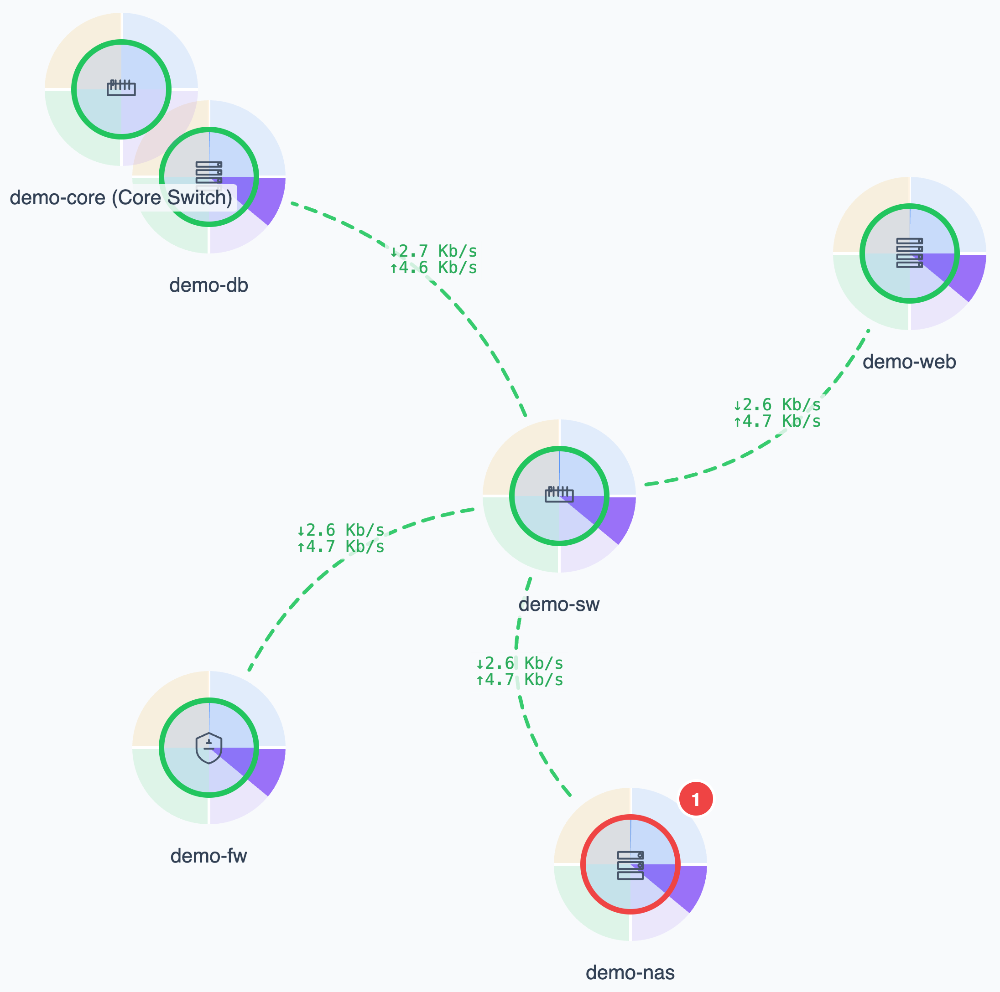
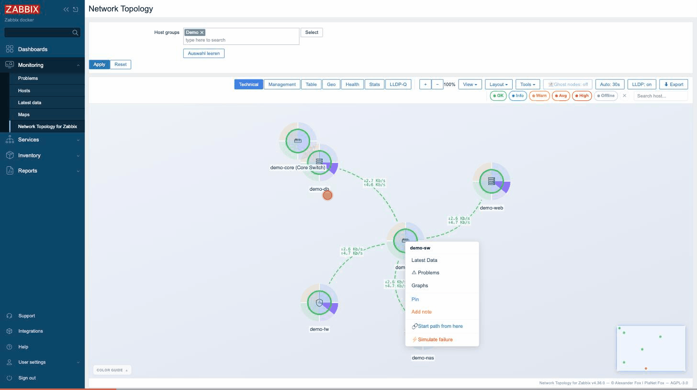
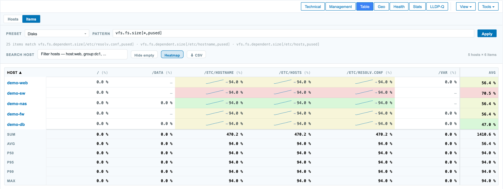
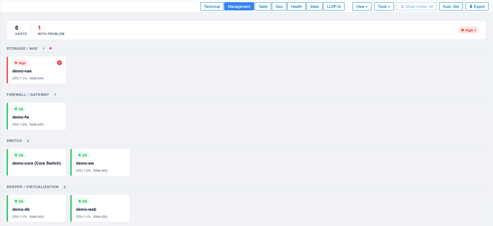
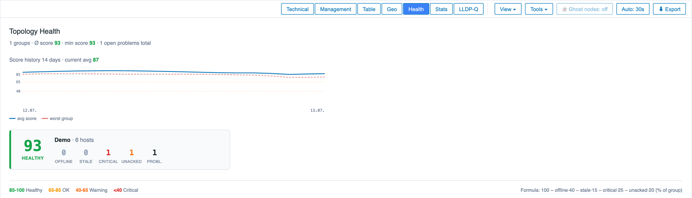
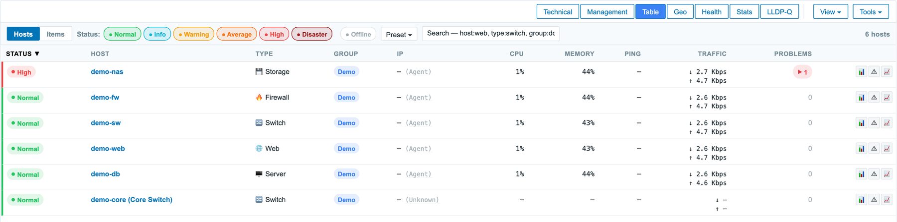
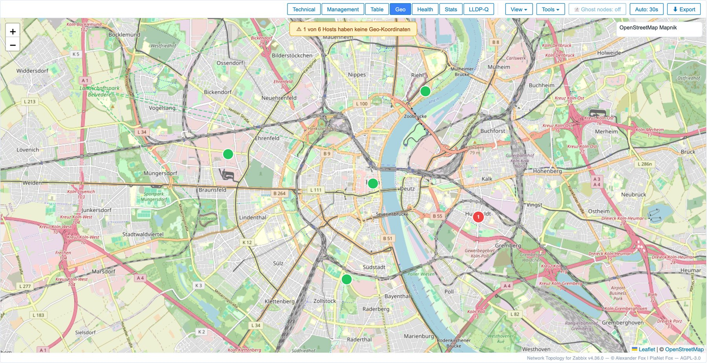

# Network Topology for Zabbix

Zabbix 7.0 LTS / 7.4 Frontend-Modul für interaktive Netzwerk-Topologie-Visualisierungen mit Cytoscape.js und Leaflet.


**[🌐 Projektseite zabfox.de](https://zabfox.de)** · **[▶ Live-Demo](https://demo.zabfox.de)** · **[💾 Repository](https://github.com/linuser/zabbix-network-topology)** · **[📋 Changelog](CHANGELOG.md)** · **[📦 Installation](INSTALL.md)**

## Was ist das?

**Network Topology for Zabbix** ist ein Frontend-Modul für **Zabbix 7.0 LTS und 7.4**, das Hosts,
Hostgruppen, Probleme, Traffic, Health-Status und Geodaten als **interaktive
Netzwerk-Topologie** visualisiert — statt Hosts nur in Listen zu sehen, zeigt es,
_wie_ sie zusammenhängen (via LLDP/CDP entdeckt), wo es klemmt und was daraus folgt.

Highlights: Live-Graph mit Severity-Ringen · **Port-zu-Port-Weathermap** (gemessene
Link-Auslastung) · What-if-Ausfallsimulation & Root-Cause · Kapazitäts-Forecast ·
Wartung direkt aus der Karte · Health-Score pro Hostgruppe · Geo-Karte · Wallboard-Modus · DE/EN.

> Technische Modul-ID: `network_topology_v6` (installiert als Verzeichnis gleichen
> Namens). Das „v6" ist die interne Modul-Lineage, nicht die Release-Version — die
> steht im Badge oben und im [CHANGELOG](CHANGELOG.md).

## Screenshots

**Technische Topologie** — Force-Directed Graph mit Severity-Ringen, CPU/Memory/Ping/Traffic als Pie-Charts und Per-Link-Weathermap (gemessene Interface-Auslastung je Kante).



**What-if-Ausfallsimulation** — Rechtsklick auf einen Host → „Simulate failure": das Modul markiert in Echtzeit, welche Hosts dadurch ihre Verbindung zum Netz-Uplink verlieren (hier: 1 Ausfall → 3 abgeschnittene Hosts).



**Item-Pivot mit Heatmap** — beliebiges Item-Key-Pattern (z. B. `vfs.fs.size[*,pused]`) als Spalten über alle Hosts der Gruppe, farbcodiert nach Wert, mit Perzentil-Aggregaten (P50/P95/P99) und CSV-Export.



<table>
<tr>
<td width="50%"><br><sub><b>Management</b> — Hosts nach Gerätetyp gruppiert (Firewall/Switch/Server/…), mit Problem-Badges und CPU/RAM je Kachel.</sub></td>
<td width="50%"><br><sub><b>Health</b> — Health-Score pro Hostgruppe mit 14-Tage-Verlauf und Offline/Stale/Critical-Aufschlüsselung.</sub></td>
</tr>
<tr>
<td width="50%"><br><sub><b>Tabelle</b> — Nagios/Icinga-Style Hostliste mit Status, Typ, IP, CPU/Memory/Ping, Traffic und offenen Problemen.</sub></td>
<td width="50%"><br><sub><b>Geo</b> — Leaflet-Karte mit Host-Standorten aus dem Host-Inventory.</sub></td>
</tr>
</table>

> Screenshots aus der öffentlichen Demo ([demo.zabfox.de](https://demo.zabfox.de)).

## Features

### Vier Visualisierungs-Modi

- **Technisch** — Force-Directed Graph mit Cytoscape.js. Knoten zeigen CPU/Memory/Ping/Traffic als Pie-Charts, Severity als Ring-Farbe.
- **Management** — Hosts gruppiert nach Device-Type (Firewall/Switch/Server/etc.) als Wallboard-Kacheln.
- **Tabelle** — Nagios/Icinga-Style Hostliste mit zwei Modi:
  - **Hosts** — Status, Type, IP, CPU, Memory, Ping, Traffic, Probleme pro Host
  - **Items** — Pivot-Tabelle: Hosts × Items (z.B. alle Disks der Hostgruppe)
- **Geo** — Leaflet-Karte mit GPS-Koordinaten aus dem Host-Inventory

> **Items-Pivot — Voraussetzung (Templates):** Die eingebauten Presets suchen nach den Item-Keys der Standard-Linux-Templates. Ist keines davon zugewiesen, bleibt die Pivot leer („Keine matching Items gefunden") — der Pivot-*Mechanismus* ist ok, es fehlen nur die passenden Items.
>
> | Preset | Item-Keys | Liefert das Template |
> |---|---|---|
> | Disks, Block-Device-IO | `vfs.fs.size[*,pused]`, `vfs.dev.util[*]`, `vfs.dev.*.rate[*]`, `vfs.dev.*.await[*]` | **Linux by Zabbix agent** (bzw. *… agent active*) — Filesystem- + Block-Device-Discovery |
> | CPU, Memory | `system.cpu.util`, `vm.memory.size[*]` | dasselbe Template |
> | Netz | `net.if.in[*]`, `net.if.out[*]` | **Linux by Zabbix agent** — Network-Interface-Discovery |
> | Ping | `icmpping*` | Template **ICMP Ping** |
>
> **SNMP-Switches** (`ifHCInOctets[…]`) und **Windows** liefern *andere* Keys — dafür statt der Presets ein **Custom-Pattern** eingeben (das Dropdown zeigt unter „Discovered" die real vorhandenen Keys deiner Auswahl).

### Layout-Optionen

- **Cluster-Modi** für Multi-Group-Auswahl: Auto / Spalten / Reihen / Aus
  - 2-3 Gruppen → vertikale Spalten
  - 4+ Gruppen → horizontale Reihen
- **Group-View** — alle Hosts einer Gruppe als ein Aggregat-Knoten
- **Force-Layout** mit cose, oder Hierarchie / Kreis / Concentric per Toggle
- **Convex-Hull-Lassos** um Hostgroups (gestrichelte Linie + Label)

### Datenfluss

- **Live-Refresh** alle 30s (toggelbar)
- **History-Mode** mit Slider — Trigger-Status zur ausgewählten Zeit (1h/24h/7d)
- **Item-Pivot** — beliebiges Item-Key-Pattern (z.B. `vfs.fs.size[*,pused]`) als Spalten
- **Manuelle Links** zwischen Hosts (Star-Mode)
- **Notizen + Pins** pro Host (lokal, im localStorage)
- **Port-zu-Port-Kanten** — auf LLDP/SNMP-Switches trägt jede Kante lokalen **und** Remote-Port; die Weathermap färbt nach *gemessener* Per-Interface-Auslastung statt Node-Schätzung (Setup: [LLDP-SETUP.md](LLDP-SETUP.md#port-zu-port--per-link-weathermap))

### Custom-Tags am Host

- `nt:icon=<typ>` — Device-Type überschreiben (firewall/router/switch/wireless/server/storage/...)
- `nt:label=<text>` — alternativer Anzeigename
- `nt:note=<text>` — Notiz-Sticker am Knoten
- `nt:link=<label>|<url>` — Custom-Link im Kontextmenü (mehrfach möglich)
- `nt:show=<key>` — zusätzlicher Item-Wert im Tooltip
- `nt:parent=<hostname>` — Träger-Host deklarieren (VM→Hypervisor, Container→Node, Blade→Chassis). Zeichnet eine gerichtete **hosts**-Kante Parent→Child (violett, Pfeil auf den gehosteten Host). Die What-if-Simulation behandelt sie als **harte Abhängigkeit**: fällt der Parent aus, fällt der Child — unabhängig vom Netzpfad. Wert = technischer oder Anzeige-Name des Parent-Hosts.

### Detail-Panel

Klick auf Knoten/Zeile → rechte Seitenleiste mit:
- Severity, CPU, Memory, Ping, Traffic
- Geräte-Typ + Custom-Indikator
- Interface (Agent/SNMP/IPMI/JMX) + Proxy-Info
- Action-Buttons: Latest Data, Probleme, Graphs, Bearbeiten

### UI-Polish

- Dark-Mode-Toggle
- Fullscreen
- Zoom-In/Out + Fit
- Mini-Map unten rechts
- Severity-Filter-Pills (Disaster/High/Avg/Warn/Info/Normal togglebar)
- Suchfeld (Host/IP/Type/Interface/Proxy)
- Hide/Show Labels
- Layout-Presets (Save/Load/Delete)
- Auto-Refresh-Toggle

## Installation

📦 **Ausführliche, zweisprachige Anleitung: [INSTALL.md](INSTALL.md) (DE/EN)** — Voraussetzungen, Widgets, Integration, Aus-Source-Bauen, Troubleshooting.

Kurzfassung (das Verzeichnis **muss** `network_topology_v6` heißen):

```bash
cd /usr/share/zabbix/ui/modules
sudo unzip ~/Downloads/network_topology_v6.zip
sudo chown -R root:root network_topology_v6
sudo systemctl reload php8.3-fpm
```

In Zabbix-UI: Administration → General → Modules → Scan directory → "Network Topology for Zabbix" aktivieren.

Aufruf via Monitoring → Network Topology for Zabbix.

## Kanten / Topologie (LLDP)

Die **Verbindungen (Kanten)** entstehen aus den LLDP/CDP-Nachbar-Tabellen der Geräte, die per SNMP an Zabbix geliefert werden. **Siehst du Knoten aber keine Kanten?** → 📡 **[LLDP-SETUP.md](LLDP-SETUP.md)**: was auf Switches/Clients/Zabbix zu tun ist, eine **Vendor-Matrix** (TP-Link / Ubiquiti / HP-Aruba / Cisco / MikroTik — was liefert Kanten, was braucht API/Handarbeit) und ein Test-Kommando zum Gegenchecken.

## Dashboard-Widget (optional)

Es gibt **drei separate Widget-Module**, die die Daten dieses Hauptmoduls in Dashboard-Kacheln rendern:

- [`widget/`](widget/) — **Topologie-Graph** (reduzierte Tech-/Mgmt-Sicht)
- [`widget_health/`](widget_health/) — **Health-Score** pro Hostgruppe
- [`widget_table/`](widget_table/) — **Tabelle** (Nagios-Style Hostliste: Status/CPU/Mem/Ping/Traffic/Probleme)

Alle nutzen dieselbe `network.topology.v6.data`-Action des Hauptmoduls (kein zweites Backend), konfigurierbar pro Widget-Instanz (Hostgroups, Filter, …).

**Voraussetzung:** Hauptmodul muss installiert + enabled sein.

> **Zabbix-Version:** Die Dashboard-Widgets brauchen **Zabbix 7.4**. Auf **7.0 LTS** registrieren sie sich zwar (PHP-View liefert 200), bleiben aber wegen der abweichenden Widget-JS-Basisklasse auf „Loading…" hängen. Das **Hauptmodul** läuft dagegen auf **7.0 LTS und 7.4**.

Am einfachsten alle drei per [`deploy.sh`](deploy.sh):

```bash
./deploy.sh <server> widgets     # nur die Widgets (Hauptmodul schon da)
# oder:  ./deploy.sh <server> all    (Hauptmodul + Widgets)
```

Dann **Scan directory** → die drei Module enablen: „Network Topology for Zabbix — Widget", „— Health Widget", „NT Table" → im Dashboard-Editor verfügbar.

## Architektur

```
network_topology_v6/
├── manifest.json              Modul-Manifest mit 14 registrierten Actions
├── Module.php                 Menü-Eintrag-Registration
├── views/
│   └── network.topology.view.php   HTML-Container + JS-Loader
├── actions/                        14 Actions (Daten als JSON via layout.json)
│   ├── NetworkTopologyView.php               rendert die Seite (layout.htmlpage)
│   ├── NetworkTopologyData.php               nodes + edges + traffic + LLDP/CDP + Health + topo_changes
│   ├── NetworkTopologyHistory.php            Trigger-Events für ein Zeitfenster (Stats-Tab)
│   ├── NetworkTopologyItems.php              Items-Pivot (Wildcard-Pattern)
│   ├── NetworkTopologyItemHistory.php        Batch-Sparklines für den Pivot
│   ├── NetworkTopologyItemCount.php          Live-Autocomplete-Count fürs Pattern
│   ├── NetworkTopologySpark.php              CPU/Ping-History für Tooltip
│   ├── NetworkTopologyDiscoverPatterns.php   Preset-Pattern-Vorschläge
│   ├── NetworkTopologyCompliance.php         Compliance-Checks pro Host (Admin)
│   ├── NetworkTopologyDiag.php               Backend-Telemetrie (Super-Admin)
│   ├── NetworkTopologyCapacityForecast.php   Link-Kapazitäts-Forecast (Zabbix-Trends)
│   ├── NetworkTopologyResourceForecast.php   CPU-/Memory-Forecast (Zabbix-Trends)
│   ├── NetworkTopologyHealthHistory.php      Health-Score-Verlauf (Trapper-Items)
│   └── NetworkTopologyMaintenance.php        One-Time-Wartung aus der Karte (WRITE, Admin)
└── assets/
    ├── css/network-topology.css
    └── js/
        ├── network-topology.js     Main: switchTab + Init + Refresh-Loop
        └── modules/                44 ESM-Module (Auswahl s.u.)
```

### Frontend-Module

| Datei | Aufgabe |
|---|---|
| `aggregation.js` | Group-View: Hostgroups als Aggregat-Knoten |
| `build-elements.js` | Cytoscape Node/Edge-Builder |
| `context-menu.js` | Rechtsklick-Menü auf Knoten |
| `detail-panel.js` | Rechte Seitenleiste mit Host-Details |
| `export.js` | PNG/PDF/HTML + Audit-Report-Export |
| `geo-providers.js` | Tile-Server-Definitionen für Leaflet |
| `group-cluster-layout.js` | Adaptiv: Spalten/Reihen-Layout pro Hostgroup |
| `group-hulls.js` | Convex-Hull-Lassos um Gruppen |
| `highlight.js` | Hover-Highlighting + Verbindungs-Edges |
| `history-mode.js` | Toggle + Slider für Zeit-basierte Trigger-Sicht |
| `icons.js` | SVG-Icons für 19 Device-Typen |
| `items-pivot.js` | Items-Pivot-Tabelle mit Preset-Patterns |
| `layouts.js` | Layout-Konfigurationen (cose, breadthfirst, etc.) |
| `legend.js` | Severity-Farb-Legende |
| `manual-links.js` | Star-Mode für manuelle Edges |
| `minimap.js` | Mini-Map unten rechts |
| `presets-ui.js` | Save/Load/Delete von Visual-States |
| `render-geo.js` | Geo-Tab (Leaflet) |
| `render-mgmt.js` | Management-Tab (Kachel-Layout) |
| `render-table.js` | Tabellen-Tab mit Hosts/Items-Modi |
| `render-tech.js` | Technisch-Tab (Hauptmodul, Cytoscape) |
| `render-tech-style.js` | Cytoscape-Stylesheet-Builder |
| `severity.js` | Severity-Farben + primaryGroup-Heuristik |
| `sev-filter.js` | Severity-Filter-Pills |
| `storage.js` | localStorage-Wrapper, User-scoped |
| `tabs.js` | Tab-Bar + Switching |
| `toolbar.js` | Top-Toolbar mit allen Buttons |
| `tooltip.js` | Hover-Tooltip auf Knoten |
| `traffic.js` | Edge-Animation + Traffic-Heatmap |
| `utils.js` | esc(), fmt(), linkCapacity(), Aggregat-Helpers |

Weitere Feature-Module (Auswahl): `whatif.js` (What-if-Ausfallsimulation),
`root-cause.js` (Ursache vs. Folge), `render-stats.js` (Stats + Kapazitäts-/Ressourcen-Forecast),
`render-health.js` (Health-Score + Verlauf), `render-compliance.js`, `render-lldp-quality.js`
(LLDP-Match-Qualität), `render-diag.js` (Admin-Telemetrie), `path-highlight.js` (BFS-Pfad),
`diff-mode.js` (Snapshot-Diff), `query.js` (Tabellen-Query-Sprache), `port-labels.js`,
`topo-notify.js` (Topologie-Änderungs-Toasts), `i18n.js` + `i18n/{de,en}.js` (DE/EN).

## Sicherheit

- **CSRF**: Actions setzen `disableCsrfValidation()` (das Frontend hat keinen Zabbix-Form-Token) und prüfen stattdessen `requireAjax()` (Header `X-Requested-With`) als CSRF-Last-Schutz — same-origin-Sessions können den Header setzen, cross-origin nicht (CORS-Preflight). Die einzige schreibende Action (`maintenance`, One-Time-Wartung aus der Karte) ist zusätzlich auf `USER_TYPE_ZABBIX_ADMIN` + Host-Schreibrecht gegated.
- **Permissions**: alle Actions prüfen `USER_TYPE_ZABBIX_USER`. Permission-Filter auf Hostgroups via `API::HostGroup()->get()` statt Frontend-trust.
- **XSS / Escaping-Konvention** (verbindlich): Jeder Wert aus Zabbix oder dem Netz — Host-/Gruppen-/Proxy-/Trigger-/Item-Name, Item-**Werte** (String-Items!), Notizen, IP und v. a. **LLDP/CDP-Nachbarnamen** (kommen per SNMP von _entfernten_ Geräten, ein Rogue-Device kann `<script>` announcen) — muss vor dem Einfügen in HTML durch `esc()` (`utils.js`, escapet `& < > " '`) laufen **oder** über `el.textContent` gesetzt werden. Fallstricke: `t()` (i18n) escaped **nicht** (roher Platzhalter-Ersatz) → Werte an `t()` müssen selbst escaped/numerisch sein oder das Ergebnis in `textContent`/`esc()` landen; `toast()` nutzt `textContent` (sicher); Cytoscape-Node-Labels sind Canvas-Text (kein HTML). Der gesamte `innerHTML`-Bestand ist auditiert (0 Lücken). Tripwire fürs Review/CI: [`tools/check-xss.sh`](tools/check-xss.sh) (mit `--strict` Exit 1 bei Verdacht).
- **SQL-Injection**: `(int)`-Cast oder `dbConditionInt()` bei DB-Zugriffen.
- **Item-Pattern**: Min 3 Non-Wildcard-Zeichen, max 5000 matching Items.
- **History**: max 50000 Events, max 7 Tage Range.
- **Spark**: max 50 hostids pro Call.
- **nt:link URL**: max 2048 Zeichen, nur http/https, kein CRLF.
- **nt:link Label**: max 200 Zeichen, kein Control-Char.
- **Race-Conditions**: Sequence-Counter bei async fetches (History/Items).

## Browser-Kompatibilität

- **Modern Browsers**: Chrome, Firefox, Safari, Edge (alle aktuelle Versionen)
- **ES6 Modules** (kein IE11)
- **fetch API**, **CSS inset**, **Surrogate-Paare** für Emoji
- **Mobile**: Touch + Long-Press für Kontextmenü (taphold-Duration konfigurierbar)

## Bekannte Einschränkungen

- Im History-Mode wird nur Severity zurückgespielt (CPU/Memory/Traffic bleiben Live)
- Items-Pivot zeigt nur numerische Items (FLOAT/UINT64)
- Max 7 Tage History-Range
- Geo-Tab braucht Hosts mit `inventory.location_lat` + `location_lon`
- LLDP-Edges brauchen Nachbar-Items per SNMP (`lldpRemSysName` / `cdpCacheDeviceId` / `neighbor.sysName` / …) — Setup + Vendor-Matrix: [LLDP-SETUP.md](LLDP-SETUP.md)
- Zabbix 7.0+ für Proxy-Group-Info (in 6.x leer)
- **Dashboard-Widgets nur Zabbix 7.4** (Widget-JS-API-Unterschied); das Hauptmodul selbst läuft auf **7.0 LTS + 7.4**

## Feedback & Mitmachen

Das Modul ist frisch veröffentlicht — Rückmeldungen sind ausdrücklich erwünscht.

- **Erst ausprobieren, dann installieren:** [demo.zabfox.de](https://demo.zabfox.de) — läuft mit Demo-Daten, nichts zu installieren.
- **Bug gefunden?** → [Issue anlegen](https://github.com/linuser/zabbix-network-topology/issues). Hilfreich sind: Zabbix-Version, PHP-Version, und bei fehlenden Kanten der SNMP-Vendor (siehe [LLDP-SETUP.md](LLDP-SETUP.md)).
- **Sicherheitslücke?** Bitte **nicht** öffentlich melden, sondern per Mail an <fox@planetfox.biz>.
- **Mehr zum Projekt und weiteren Zabbix-Modulen:** [zabfox.de](https://zabfox.de)

## Lizenz

**AGPL-3.0-or-later** — © 2026 PlaNet Fox / Alexander Fox. Volltext: [LICENSE](LICENSE).

Dieses Modul ist ein abgeleitetes Werk des Zabbix-Frontends — es leitet von
Zabbix-Klassen (`CController` u. a.) ab und läuft im selben Prozess. Zabbix 7
steht unter der AGPL-3.0; das kombinierte Werk unterliegt daher ebenfalls der
AGPL-3.0. Kurz: nutzen, weitergeben und ändern erlaubt — wer es (auch als
Netzwerk-Dienst) bereitstellt, muss den Quellcode inkl. eigener Änderungen unter
AGPL-3.0 verfügbar machen.

Mitgelieferte Fremdkomponenten (Cytoscape.js — MIT, Leaflet 1.9.4 — BSD-2-Clause) stehen unter ihren eigenen, permissiven Lizenzen: [THIRD-PARTY-LICENSES.md](THIRD-PARTY-LICENSES.md).

## Autor

PlaNet Fox / Alexander Fox <fox@planetfox.biz>
