# Network Topology for Zabbix

Zabbix 7.0 LTS / 7.4 frontend module for interactive network topology visualisation, built on Cytoscape.js and Leaflet.
*Zabbix 7.0 LTS / 7.4 Frontend-Modul für interaktive Netzwerk-Topologie-Visualisierungen mit Cytoscape.js und Leaflet.*


**[🌐 zabfox.de](https://zabfox.de)** · **[💾 Repository](https://github.com/linuser/zabbix-network-topology)** · **[📋 Changelog](CHANGELOG.md)** · **[📦 Installation](INSTALL.md)** · **[🤝 Contributing](CONTRIBUTING.md)**

**🇬🇧 [English](#-english) · 🇩🇪 [Deutsch](#-deutsch)**

> Technical module id: `network_topology` — the installation directory **must** carry exactly this name. *Das Installationsverzeichnis muss genau so heißen.*
>
> **Upgrading from 4.x:** the `_v6` suffix is gone in 5.0 — remove the old `network_topology_v6` directory and re-add the dashboard tiles once; see [CHANGELOG](CHANGELOG.md) and [INSTALL.md](INSTALL.md). *Umstieg von 4.x: der `_v6`-Suffix ist entfallen, das alte Verzeichnis muss weg, die Kacheln sind einmalig neu einzufügen.*

---

## Screenshots

**Technical topology** — force-directed graph with severity rings, CPU/memory/ping/traffic pie charts, per-link weathermap and the key-figure row above the map.
*Technische Topologie — Force-Directed Graph mit Severity-Ringen, Pie-Charts, Per-Link-Weathermap und Kennzahlen-Zeile über der Karte.*

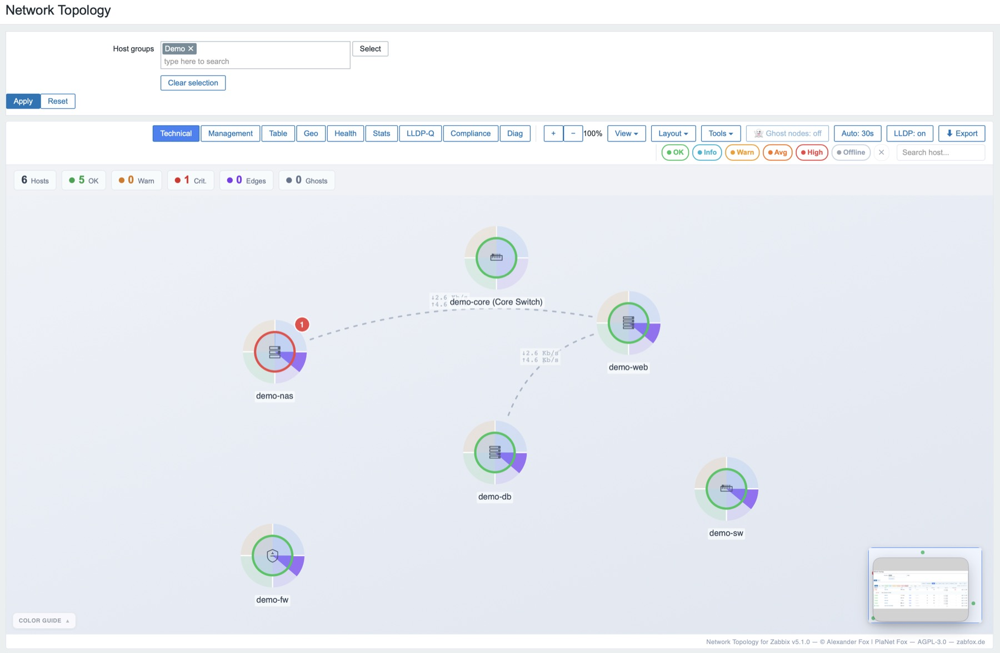

**What-if failure simulation** — right-click a host → "Simulate failure". The failed host greys out, every host that loses its path is marked red, and the banner counts them.
*What-if-Ausfallsimulation — Rechtsklick auf einen Host: der ausgefallene wird ausgegraut, jeder Host ohne Pfad rot markiert, das Banner zählt sie.*

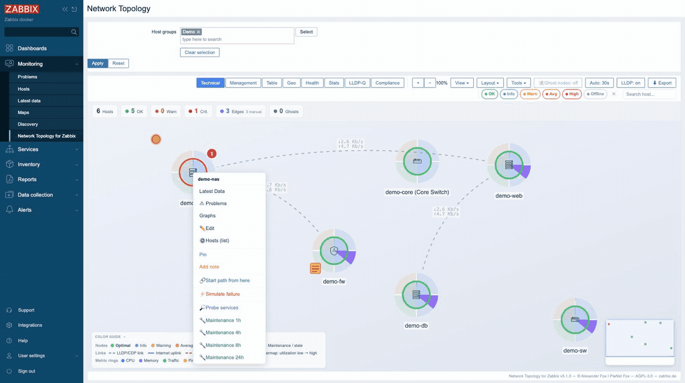

**Drawing a link by hand** — Tools → *Draw link*, then click two hosts. The map dims everything else so the two ends stay obvious. The edge is stored **server-side** right away: a Super admin draws for everyone, anyone else for themselves.
*Verbindung von Hand ziehen — Tools → „Draw link", dann zwei Hosts anklicken. Die Karte dimmt alles andere, damit die beiden Enden sichtbar bleiben. Die Kante liegt sofort auf dem Server: ein Super-Admin zeichnet für alle, jeder andere für sich.*

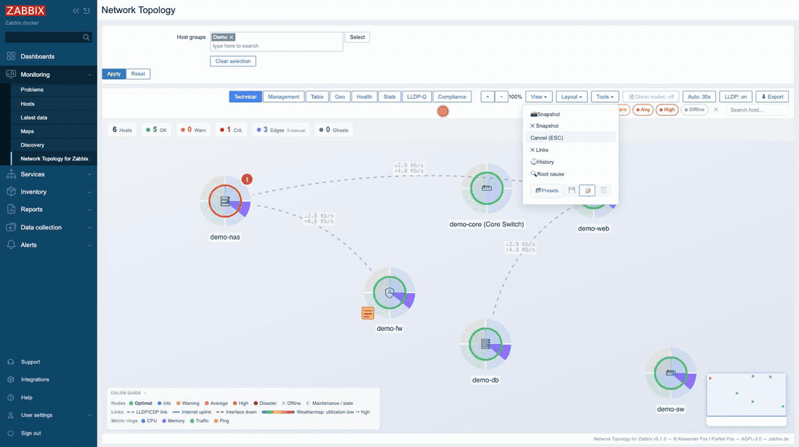

**Item pivot with heatmap** — any item key pattern (e.g. `vfs.fs.size[*,pused]`) as columns across all hosts, colour-coded, with percentiles (P50/P95/P99) and CSV export.
*Item-Pivot mit Heatmap — beliebiges Item-Key-Pattern als Spalten über alle Hosts, farbcodiert, mit Perzentilen und CSV-Export.*

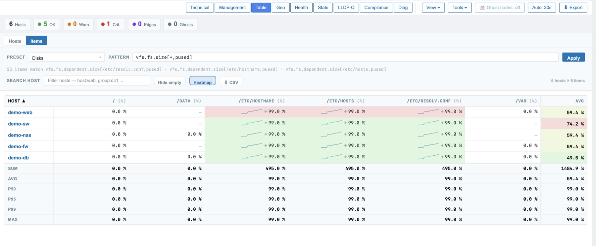

<table>
<tr>
<td width="50%">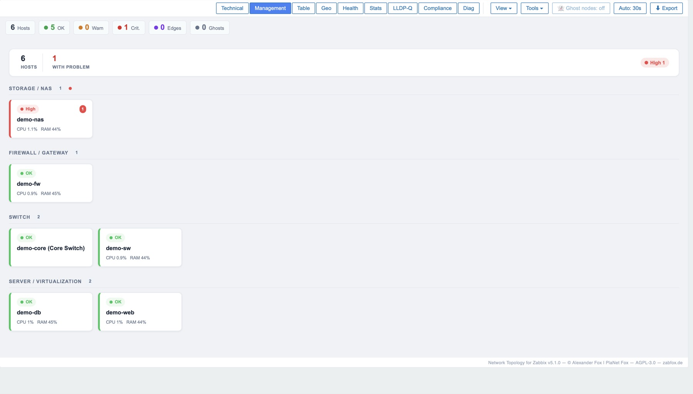<br><sub><b>Management</b> — hosts grouped by device type, with problem badges and CPU/RAM per tile.<br><i>Hosts nach Gerätetyp gruppiert, mit Problem-Badges und CPU/RAM je Kachel.</i></sub></td>
<td width="50%">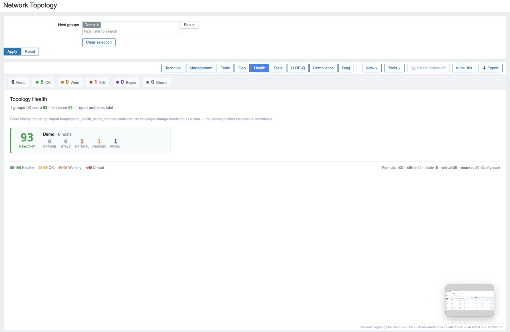<br><sub><b>Health</b> — health score per host group with a 14-day trend.<br><i>Health-Score pro Hostgruppe mit 14-Tage-Verlauf.</i></sub></td>
</tr>
<tr>
<td width="50%">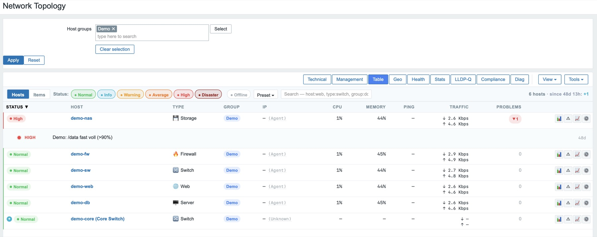<br><sub><b>Table / Tabelle</b> — Nagios-style host list with status, type, IP, metrics and open problems.<br><i>Nagios-Style Hostliste mit Status, Typ, IP, Metriken und offenen Problemen.</i></sub></td>
<td width="50%">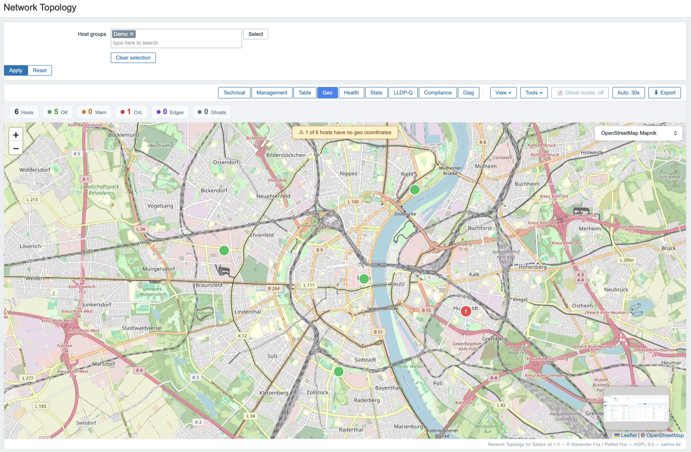<br><sub><b>Geo</b> — Leaflet map with host locations from the host inventory.<br><i>Leaflet-Karte mit Host-Standorten aus dem Host-Inventory.</i></sub></td>
</tr>
<tr>
<td width="50%">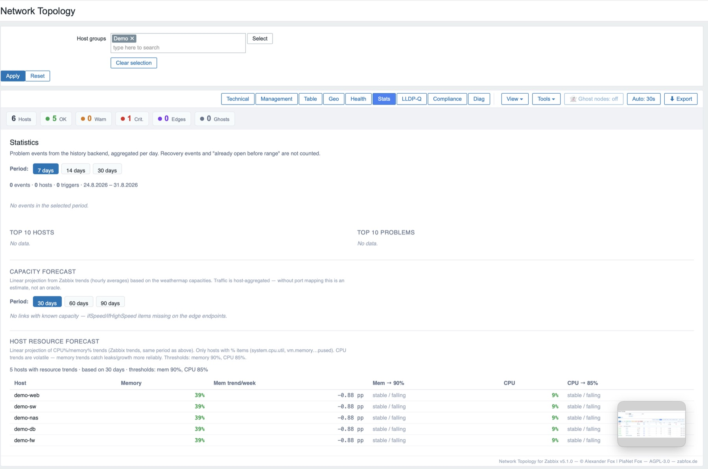<br><sub><b>Stats</b> — distribution by severity, device type and host group.<br><i>Verteilung nach Severity, Gerätetyp und Hostgruppe.</i></sub></td>
<td width="50%">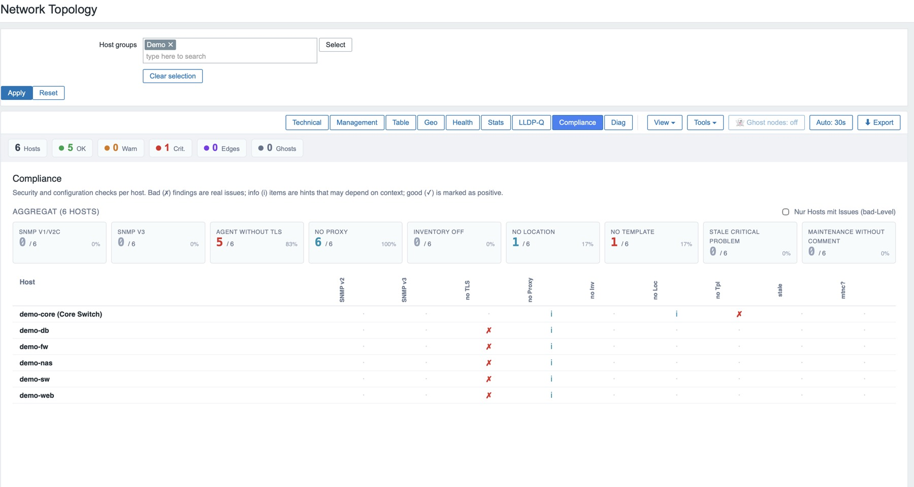<br><sub><b>Compliance</b> — per-host checks (admin only): templates, interfaces, inventory, tags.<br><i>Prüfungen je Host (nur Admin): Templates, Interfaces, Inventory, Tags.</i></sub></td>
</tr>
<tr>
<td width="50%">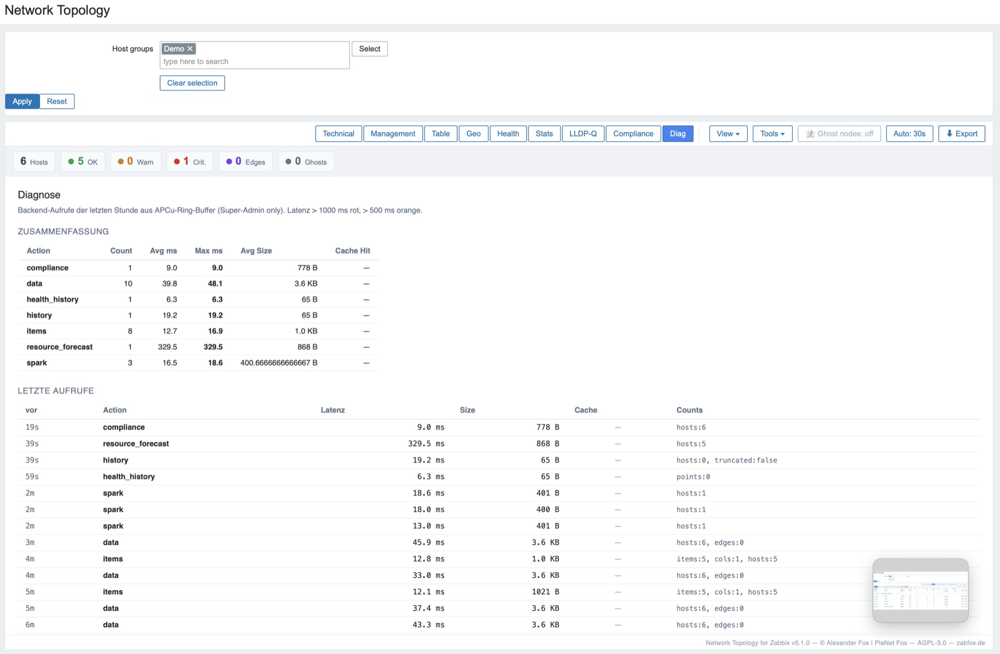<br><sub><b>Diag</b> — backend telemetry (super admin only): cache hit rate, latencies, counts.<br><i>Backend-Telemetrie (nur Super-Admin): Cache-Trefferquote, Latenzen, Zählwerte.</i></sub></td>
<td width="50%">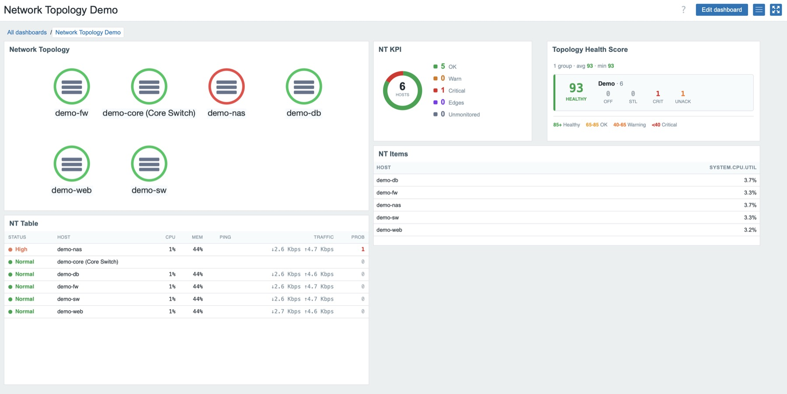<br><sub><b>Dashboard widgets</b> — all five tiles on one Zabbix dashboard.<br><i>Alle fünf Kacheln auf einem Zabbix-Dashboard.</i></sub></td>
</tr>
</table>

---

## 🇬🇧 English

### What is this?

**Network Topology for Zabbix** is a frontend module for **Zabbix 7.0 LTS and 7.4** that visualises hosts, host groups, problems, traffic, health status and geo data as an **interactive network topology** — instead of seeing hosts as a flat list, you see _how_ they connect (discovered via LLDP/CDP), where it hurts, and what follows from it.

> **This is a page, not a dashboard widget.** The main module adds its own entry
> under **Monitoring → Network Topology**: a full screen with its own tabs, filters
> and detail panel. Worth saying plainly, because most community modules for
> Zabbix are widgets — so "module" tends to be read as "tile on a dashboard".
>
> | What | Needed? | Requires |
> |---|---|---|
> | **Main module** — the topology page | **required**, this is the product | Zabbix 7.0 LTS or 7.4 |
> | **Five dashboard widgets** — tiles for existing dashboards | optional extras | Zabbix **7.4**, and the main module installed *and* enabled |
>
> The widgets read the main module's data action and load Cytoscape from its
> assets; without it they show an error. Install the main module first.

Highlights: live graph with severity rings · **port-to-port weathermap** (measured link utilisation) · **key-figure row** above the map · **ghost nodes** for devices reported via LLDP that have no host in Zabbix · what-if failure simulation & root cause · capacity forecast · maintenance straight from the map · health score per host group · geo map · **five dashboard widgets** · wallboard mode · German/English UI.

### Features

**Four visualisation modes**

- **Technical** — force-directed graph (Cytoscape.js). Nodes show CPU/memory/ping/traffic as pie charts, severity as ring colour.
- **Management** — hosts grouped by device type (firewall/switch/server/…) as wallboard tiles.
- **Table** — Nagios/Icinga-style host list in two modes: **Hosts** (status, type, IP, CPU, memory, ping, traffic, problems) and **Items** (pivot: hosts × items, e.g. every disk in the group).
- **Geo** — Leaflet map using GPS coordinates from the host inventory.

> **Item pivot — prerequisite (templates):** the built-in presets look for the item keys of the standard Linux templates. With none of them linked, the pivot stays empty ("no matching items") — the mechanism is fine, the items are simply missing.
>
> | Preset | Item keys | Provided by |
> |---|---|---|
> | Disks, block device IO | `vfs.fs.size[*,pused]`, `vfs.dev.util[*]`, `vfs.dev.*.rate[*]` | **Linux by Zabbix agent** |
> | CPU, memory | `system.cpu.util`, `vm.memory.size[*]` | same template |
> | Network | `net.if.in[*]`, `net.if.out[*]` | **Linux by Zabbix agent** |
> | Ping | `icmpping*` | **ICMP Ping** template |
>
> **SNMP switches** (`ifHCInOctets[…]`) and **Windows** expose *different* keys — use a **custom pattern** there; the dropdown lists the keys actually present under "Discovered".

**Layout**

- **Cluster modes** for multi-group selections: auto / columns / rows / off
- **Group view** — every host of a group collapsed into one aggregate node
- **Force layout** (cose), hierarchy, circle or concentric via toggle
- **Convex-hull lassos** around host groups

**Data flow**

- **Live refresh** every 30 s (can be turned off)
- **History mode** with slider — trigger state at the selected time (1 h/24 h/7 d)
- **Item pivot** — any item key pattern as columns
- **Manual links** between hosts and the **map layout** — stored server-side in two layers: a Super admin curates the map everyone sees, anyone else deviates personally. Notes and pins still live in `localStorage`. Both layers store the *complete* state, so a save that would overwrite someone else's concurrent change is **rejected instead of applied** — you get a notice and reload rather than silently losing the other person's work
- **Port-to-port edges** — on LLDP/SNMP switches each edge carries both the local **and** the remote port; the weathermap colours by *measured* per-interface utilisation instead of a node-level estimate ([LLDP-SETUP.md](LLDP-SETUP.md))
- **Configurable colour scales** — Super admins set the thresholds and colours for both link scales (absolute traffic with weathermap off, utilisation % with it on) under *View → Color scales*; changes preview live, are stored in the module config and apply to all users. The colour guide shows the scale of the active mode and marks a customised one

**Key figures and unmonitored devices**

- **A key-figure row above the map** — hosts, OK/warn/critical, edges and
  unmonitored neighbours at a glance. Compact chips, large tiles in wallboard
  mode (`?wallboard=1`). The same numbers are available as a dashboard tile
  (**NT KPI**), as a ring or a grid.
- **Ghost nodes** — devices a switch reports via LLDP/CDP for which **no host
  exists in Zabbix**. They appear dashed, with their origin (who reported
  them) and — where the device provides it — vendor, device type and MAC from
  the LLDP table. For admins, a menu entry opens Zabbix' own host form
  **pre-filled**; the host is created by Zabbix, not by the module.
- **Device type from the protocol** — the icon comes from the host name and
  templates first, matching **model series, not vendor names**: a plain "UniFi"
  or "Omada" covers gateways, switches, cameras and access points alike and
  says nothing about what a device is. Where that yields nothing, the **LLDP
  capabilities** decide (IEEE 802.1AB: Bridge → switch, Router, WLAN AP). The
  device announces what it is, vendor-independently. `nt:icon` overrides both.
- **Service probe on click** — a context-menu entry checks a fixed list of 11
  ports and distinguishes *open* / *refused* / *timeout*. It runs on click
  only, never on its own; the address is resolved server-side through the
  Zabbix API so your permissions apply; requires Zabbix Admin and is throttled
  to 5 calls per minute.

**Custom host tags**

- `nt:icon=<type>` — override the device type (firewall/router/switch/server/storage/…)
- `nt:label=<text>` — alternative display name
- `nt:note=<text>` — note sticker on the node
- `nt:link=<label>|<url>` — custom link in the context menu (repeatable)
- `nt:show=<key>` — extra item value in the tooltip
- `nt:parent=<hostname>` — declare a carrier host (VM→hypervisor, container→node). Draws a directed **hosts** edge, and the what-if simulation treats it as a **hard dependency**: if the parent dies, the child dies — regardless of the network path.

**More UI**

Per-host detail panel (severity, metrics, interface, proxy, action buttons) · dark mode · fullscreen · zoom + fit · mini-map · severity filter pills · search field with a small query language · layout presets.

### Installation

📦 **Full bilingual guide: [INSTALL.md](INSTALL.md)** — requirements, RHEL/SELinux, widgets, building from source, troubleshooting.

Short version (the directory **must** be named `network_topology`):

```bash
# Where modules/ lives differs — packages from the Zabbix repo use
# /usr/share/zabbix/modules WITHOUT "ui". When unsure, look it up:
#   sudo find / -maxdepth 6 -type d -path '*zabbix*' -name modules
cd /usr/share/zabbix/ui/modules       # or /usr/share/zabbix/modules

sudo unzip ~/Downloads/network_topology.zip
sudo chown -R root:root network_topology
sudo systemctl reload php8.2-fpm      # service name depends on distro/PHP version
```

Then in the Zabbix UI: **Administration → General → Modules → Scan directory** → enable "Network Topology for Zabbix". Open it via **Monitoring → Network Topology for Zabbix**.

There is a guided path too: [`nt-install.sh`](nt-install.sh) detects the module path and php-fpm service itself, checks the environment first (`check`), and restores the SELinux context on RHEL/Rocky/Alma — without it the module simply does not show up there. [`nt-uninstall.sh`](nt-uninstall.sh) removes it again and names what stays behind on the server.

> **Don't install via `git clone`.** It places the entire repository under your web root, and Zabbix' nginx config only blocks `/\.ht` there, not `.git` — see [INSTALL.md](INSTALL.md).

### Edges / topology (LLDP)

**Edges** come from the LLDP/CDP neighbour tables of your devices, delivered to Zabbix via SNMP. **Nodes but no edges?** → 📡 **[LLDP-SETUP.md](LLDP-SETUP.md)**: what to configure on switches/clients/Zabbix, a **vendor matrix** (TP-Link / Ubiquiti / HP-Aruba / Cisco / Huawei / MikroTik) and a test command to verify.

> **The module does not speak SNMP — it reads Zabbix items.** Enabling LLDP on
> the device is only half the chain:
> `switch (LLDP on) → Zabbix items → this module`.
> The stock vendor templates (Huawei VRP, Cisco IOS, HP) do **not** collect the
> neighbour table, so link [`nt_lldp_snmp_template.yaml`](templates/nt_lldp_snmp_template.yaml)
> in addition. Then don't wait: discovery runs every **3 h** by default — use
> *Discovery rules → LLDP neighbor discovery → **Execute now***, and check under
> *Latest data* that `lldpRemSysName` items actually hold values. Until they do,
> the map is empty by design.

### Dashboard widgets (optional)

Five separate widget modules render the main module's data as dashboard tiles. They appear as **NT …** in the widget menu:

| Directory | Widget | What it shows |
|---|---|---|
| [`widget/`](widget/) | **NT Topology** | topology graph, reduced tech/mgmt view |
| [`widget_health/`](widget_health/) | **NT Health Score** | health score per host group |
| [`widget_table/`](widget_table/) | **NT Table** | table (status/CPU/mem/ping/traffic/problems) |
| [`widget_kpi/`](widget_kpi/) | **NT KPI** | key figures as a ring (severity distribution with the host count in the middle) or as a grid |
| [`widget_items/`](widget_items/) | **NT Items** | one item pattern pivoted across all hosts of the selected groups |

All consume the same `network.topology.data` action (no second backend) and share its response: with several tiles on one dashboard the action is fetched **once**, not per tile. **Prerequisite:** the main module installed and enabled.

> **The widgets do not work standalone** — for two reasons: the data action `network.topology.data` is registered by the **main module**, and the topology widget additionally loads Cytoscape.js from its directory (`modules/network_topology/assets/js/`), so the ~360 KB library ships only once. Without the main module — or with it disabled — the tiles show an error ("main module unreachable" / "Cytoscape.js not loaded"). So install in this order: **main module first, widgets second.**

> **Zabbix version:** the widgets require **Zabbix 7.4**. On **7.0 LTS** they do register, but stay stuck on "Loading…" because the widget JS base class differs. The **main module** runs on **7.0 LTS and 7.4**.

### Security

- **CSRF:** read actions require `requireAjax()` (`X-Requested-With` header) — same-origin sessions can set it, cross-origin cannot (CORS preflight). **Four actions have outward effects** and additionally verify a real Zabbix CSRF token: maintenance windows (admin **plus** host write permission), manual links and map layout (the shared layer is Super admin only), and the port probe — the only one acting outside Zabbix, with a fixed port list and a target resolved server-side from the host ID, never supplied by the client. Details in [SECURITY.md](SECURITY.md).
- **Permissions:** every action checks the user type; client-supplied IDs are intersected against `API::…->get()` rather than trusted. The **shared layer** (manual links, map layout) lives in `module.config` and knows no permissions of its own, so it is filtered against the caller's visible hosts and groups before it is embedded in the page — otherwise the delivered JSON would enumerate host IDs, group IDs and LLDP-announced device names from parts of the network the user may not monitor.
- **XSS / escaping convention** (binding): every value from Zabbix or from the network — host/group/proxy/item names, item **values**, notes, IPs and especially **LLDP/CDP neighbour names** (announced by _foreign_ devices via SNMP; a rogue device can announce `<script>`) — must pass through `esc()` or be set via `textContent`. Two CI gates enforce this: [`tools/check-xss.sh`](tools/check-xss.sh) and ESLint `no-unsanitized` — both cover the widget modules as well.
- **SQL injection:** `(int)` casts / `dbConditionInt()`; exactly one raw query in the whole codebase (the last-value lookup, which **requires SQL history tables** — with Elasticsearch history storage the map shows nodes without metrics).
- **Throttling:** APCu when present, otherwise a weaker per-session fallback. Relevant mainly for the port probe, which works synchronously — APCu is therefore recommended, not merely optional.
- **Limits:** item pattern min. 3 non-wildcard chars / max. 5000 items · history max. 50,000 events and 7 days · spark max. 50 host ids · `nt:link` URL max. 2048 chars, http/https only.

Found a vulnerability? → [SECURITY.md](SECURITY.md) (please **not** as a public issue).

### Browsers

Current Chrome, Firefox, Safari, Edge. ES6 modules (no IE11), `fetch`, CSS `inset`. Mobile: touch + long-press for the context menu.

### Known limitations

- History mode replays severity only (CPU/memory/traffic stay live)
- Item pivot shows numeric items only (FLOAT/UINT64)
- History range capped at 7 days
- Geo tab needs hosts with `inventory.location_lat` + `location_lon`
- LLDP edges need neighbour items via SNMP → [LLDP-SETUP.md](LLDP-SETUP.md)
- Zabbix 7.0+ for proxy group info (empty on 6.x)
- **Dashboard widgets are Zabbix 7.4 only**; the main module runs on 7.0 LTS + 7.4

### Feedback & contributing

- **Found a bug?** → [open an issue](https://github.com/linuser/zabbix-network-topology/issues). Please include your Zabbix version, PHP version, and for missing edges the SNMP vendor.
- **Want to send a patch?** → [CONTRIBUTING.md](CONTRIBUTING.md) — it lists the eight rules CI enforces strictly.
- **Security issue?** → [SECURITY.md](SECURITY.md), confidentially by mail.

### Thanks

**[@christos-diamantis](https://github.com/christos-diamantis)** has shaped a
large part of 5.1.1 and 5.2.0 — the `walk[]` rework of the LLDP template, the
host + hop-radius scope with focus mode, and the mode-aware color guide with
configurable scales. He tests against real hardware (FortiGate, MikroTik,
Huawei) and sends the patch along with the report. Several of the defects he
found had been in the module since the code was written.

---

## 🇩🇪 Deutsch

### Was ist das?

**Network Topology for Zabbix** ist ein Frontend-Modul für **Zabbix 7.0 LTS und 7.4**, das Hosts, Hostgruppen, Probleme, Traffic, Health-Status und Geodaten als **interaktive Netzwerk-Topologie** visualisiert — statt Hosts nur in Listen zu sehen, zeigt es, _wie_ sie zusammenhängen (via LLDP/CDP entdeckt), wo es klemmt und was daraus folgt.

> **Das ist eine Seite, kein Dashboard-Widget.** Das Hauptmodul legt einen eigenen
> Eintrag unter **Monitoring → Network Topology** an: eine vollständige Ansicht mit
> eigenen Tabs, Filtern und Detail-Panel. Das sei ausdrücklich gesagt, weil die
> meisten Community-Module für Zabbix Widgets sind — „Modul" wird deshalb leicht
> als „Kachel auf einem Dashboard" gelesen.
>
> | Was | Nötig? | Braucht |
> |---|---|---|
> | **Hauptmodul** — die Topologie-Seite | **erforderlich**, das ist das Produkt | Zabbix 7.0 LTS oder 7.4 |
> | **Fünf Dashboard-Widgets** — Kacheln für bestehende Dashboards | optionale Zugabe | Zabbix **7.4**, dazu das installierte *und* aktivierte Hauptmodul |
>
> Die Widgets nutzen die Daten-Action des Hauptmoduls und laden Cytoscape aus
> dessen Assets; ohne es zeigen sie eine Fehlermeldung. Erst das Hauptmodul.

Highlights: Live-Graph mit Severity-Ringen · **Port-zu-Port-Weathermap** (gemessene Link-Auslastung) · **Kennzahlen-Zeile** über der Karte · **Ghost-Knoten** für per LLDP gemeldete Geräte ohne Host in Zabbix · What-if-Ausfallsimulation & Root-Cause · Kapazitäts-Forecast · Wartung direkt aus der Karte · Health-Score pro Hostgruppe · Geo-Karte · **fünf Dashboard-Widgets** · Wallboard-Modus · DE/EN.

### Features

**Vier Visualisierungs-Modi**

- **Technisch** — Force-Directed Graph mit Cytoscape.js. Knoten zeigen CPU/Memory/Ping/Traffic als Pie-Charts, Severity als Ring-Farbe.
- **Management** — Hosts gruppiert nach Device-Type (Firewall/Switch/Server/etc.) als Wallboard-Kacheln.
- **Tabelle** — Nagios/Icinga-Style Hostliste mit zwei Modi: **Hosts** (Status, Type, IP, CPU, Memory, Ping, Traffic, Probleme) und **Items** (Pivot: Hosts × Items, z. B. alle Disks der Hostgruppe).
- **Geo** — Leaflet-Karte mit GPS-Koordinaten aus dem Host-Inventory.

> **Items-Pivot — Voraussetzung (Templates):** Die eingebauten Presets suchen nach den Item-Keys der Standard-Linux-Templates. Ist keines davon zugewiesen, bleibt die Pivot leer („Keine matching Items gefunden") — der Mechanismus ist ok, es fehlen nur die passenden Items.
>
> | Preset | Item-Keys | Liefert das Template |
> |---|---|---|
> | Disks, Block-Device-IO | `vfs.fs.size[*,pused]`, `vfs.dev.util[*]`, `vfs.dev.*.rate[*]` | **Linux by Zabbix agent** |
> | CPU, Memory | `system.cpu.util`, `vm.memory.size[*]` | dasselbe Template |
> | Netz | `net.if.in[*]`, `net.if.out[*]` | **Linux by Zabbix agent** |
> | Ping | `icmpping*` | Template **ICMP Ping** |
>
> **SNMP-Switches** (`ifHCInOctets[…]`) und **Windows** liefern *andere* Keys — dafür ein **Custom-Pattern** eingeben; das Dropdown zeigt unter „Discovered" die real vorhandenen Keys.

**Layout**

- **Cluster-Modi** für Multi-Group-Auswahl: Auto / Spalten / Reihen / Aus
- **Group-View** — alle Hosts einer Gruppe als ein Aggregat-Knoten
- **Force-Layout** (cose), Hierarchie, Kreis oder Concentric per Toggle
- **Convex-Hull-Lassos** um Hostgroups

**Datenfluss**

- **Live-Refresh** alle 30 s (abschaltbar)
- **History-Mode** mit Slider — Trigger-Status zur ausgewählten Zeit (1 h/24 h/7 d)
- **Item-Pivot** — beliebiges Item-Key-Pattern als Spalten
- **Manuelle Links** zwischen Hosts und **Kartenanordnung** — serverseitig, in zwei Ebenen: ein Super-Admin pflegt die für alle sichtbare Karte, jeder andere weicht persönlich davon ab. Notizen und Pins liegen weiterhin im `localStorage`. Beide Ebenen speichern den *vollständigen* Zustand; ein Speichern, das die gleichzeitige Änderung eines anderen überschreiben würde, wird deshalb **abgelehnt statt ausgeführt** — mit Hinweis und Neuladen, statt die Arbeit des anderen stillschweigend zu verlieren
- **Port-zu-Port-Kanten** — auf LLDP/SNMP-Switches trägt jede Kante lokalen **und** Remote-Port; die Weathermap färbt nach *gemessener* Per-Interface-Auslastung statt Node-Schätzung ([LLDP-SETUP.md](LLDP-SETUP.md#port-to-port--per-link-weathermap))
- **Konfigurierbare Farbskalen** — Super-Admins setzen Schwellen und Farben beider Kantenskalen (absoluter Traffic bei Weathermap aus, Auslastung in % bei an) unter *View → Farbskalen…*; Änderungen sind sofort als Vorschau sichtbar, liegen in der Modul-Config und gelten für alle. Der Farbcode zeigt die Skala des aktiven Modus und kennzeichnet eine angepasste

**Kennzahlen und unüberwachte Geräte**

- **Kennzahlen-Zeile über der Karte** — Hosts, OK/Warn/Krit., Kanten und
  unüberwachte Nachbarn auf einen Blick. Kompakte Chips, im Wallboard-Modus
  (`?wallboard=1`) große Kacheln. Dieselben Zahlen gibt es als Dashboard-Kachel
  (**NT KPI**), wahlweise als Ring oder Raster.
- **Ghost-Knoten** — Geräte, die ein Switch per LLDP/CDP meldet, für die es
  aber **keinen Host in Zabbix gibt**. Sie erscheinen gestrichelt, mit
  Herkunftsangabe (wer sie gemeldet hat) und — sofern das Gerät es liefert —
  Hersteller, Gerätetyp und MAC aus der LLDP-Tabelle. Für Admins öffnet ein
  Menüeintrag Zabbix' eigenes Host-Formular **vorbefüllt**; angelegt wird der
  Host von Zabbix, nicht vom Modul.
- **Gerätetyp aus dem Protokoll** — welches Symbol ein Knoten bekommt, leitet
  sich zuerst aus Name und Template ab, und zwar über **Modellreihen, nicht über
  Herstellernamen**: ein bloßes „UniFi" oder „Omada" umfasst Gateways, Switches,
  Kameras und Accesspoints gleichermaßen und sagt nichts darüber, *was* ein
  Gerät ist. Greift das nicht, entscheiden die **LLDP-Capabilities** (IEEE
  802.1AB: Bridge → Switch, Router, WLAN AP). Das Gerät sagt selbst, was es ist,
  herstellerunabhängig. `nt:icon` überstimmt beides.
- **Dienste-Probe auf Klick** — im Kontextmenü eines Hosts prüft ein Eintrag
  eine feste Liste von 11 Ports und unterscheidet *offen* / *abgewiesen* /
  *Zeitüberschreitung*. Läuft nur auf Klick, nie von selbst; die Adresse löst
  der Server über die Zabbix-API auf, damit die Rechte des Benutzers greifen;
  Zabbix-Admin nötig, auf 5 Aufrufe pro Minute gedrosselt.

**Custom-Tags am Host**

- `nt:icon=<typ>` — Device-Type überschreiben (firewall/router/switch/server/storage/…)
- `nt:label=<text>` — alternativer Anzeigename
- `nt:note=<text>` — Notiz-Sticker am Knoten
- `nt:link=<label>|<url>` — Custom-Link im Kontextmenü (mehrfach möglich)
- `nt:show=<key>` — zusätzlicher Item-Wert im Tooltip
- `nt:parent=<hostname>` — Träger-Host deklarieren (VM→Hypervisor, Container→Node). Zeichnet eine gerichtete **hosts**-Kante und gilt der What-if-Simulation als **harte Abhängigkeit**: fällt der Parent aus, fällt der Child — unabhängig vom Netzpfad.

**Weitere UI**

Detail-Panel je Host (Severity, Metriken, Interface, Proxy, Action-Buttons) · Dark-Mode · Fullscreen · Zoom + Fit · Mini-Map · Severity-Filter-Pills · Suchfeld mit Query-Sprache · Layout-Presets.

### Installation

📦 **Ausführliche, zweisprachige Anleitung: [INSTALL.md](INSTALL.md)** — Voraussetzungen, RHEL/SELinux, Widgets, Aus-Source-Bauen, Troubleshooting.

Kurzfassung (das Verzeichnis **muss** `network_topology` heißen):

```bash
# Wo modules/ liegt, ist nicht ueberall gleich — Pakete aus dem Zabbix-Repo
# nutzen /usr/share/zabbix/modules OHNE "ui". Im Zweifel suchen:
#   sudo find / -maxdepth 6 -type d -path '*zabbix*' -name modules
cd /usr/share/zabbix/ui/modules       # oder /usr/share/zabbix/modules

sudo unzip ~/Downloads/network_topology.zip
sudo chown -R root:root network_topology
sudo systemctl reload php8.2-fpm      # Dienstname je nach Distro/PHP-Version
```

Dann in der Zabbix-UI: **Administration → General → Modules → Scan directory** → „Network Topology for Zabbix" aktivieren. Aufruf über **Monitoring → Network Topology for Zabbix**.

Es geht auch geführt: [`nt-install.sh`](nt-install.sh) erkennt Modulpfad und php-fpm-Dienst selbst, prüft die Umgebung vorher (`check`) und setzt auf RHEL/Rocky/Alma den SELinux-Kontext — ohne den erscheint das Modul dort schlicht nicht. [`nt-uninstall.sh`](nt-uninstall.sh) räumt wieder ab und nennt dabei, was serverseitig zurückbleibt.

> **Nicht per `git clone` installieren.** Der Weg legt das gesamte Repository unter den Web-Root, und Zabbix' nginx-Konfiguration sperrt dort nur `/\.ht`, nicht `.git` — siehe [INSTALL.md](INSTALL.md).

### Kanten / Topologie (LLDP)

Die **Verbindungen (Kanten)** entstehen aus den LLDP/CDP-Nachbar-Tabellen der Geräte, die per SNMP an Zabbix geliefert werden. **Knoten da, aber keine Kanten?** → 📡 **[LLDP-SETUP.de.md](LLDP-SETUP.de.md)** (englisch: [LLDP-SETUP.md](LLDP-SETUP.md)): was auf Switches/Clients/Zabbix zu tun ist, eine **Vendor-Matrix** (TP-Link / Ubiquiti / HP-Aruba / Cisco / Huawei / MikroTik) und ein Test-Kommando zum Gegenchecken.

> **Das Modul spricht kein SNMP — es liest Zabbix-Items.** LLDP am Gerät
> einzuschalten ist nur die halbe Kette:
> `Switch (LLDP an) → Zabbix-Items → dieses Modul`.
> Die offiziellen Vendor-Templates (Huawei VRP, Cisco IOS, HP) sammeln die
> Nachbar-Tabelle **nicht** — zusätzlich [`nt_lldp_snmp_template.yaml`](templates/nt_lldp_snmp_template.yaml)
> linken. Und dann nicht warten: die Discovery läuft per Default alle **3 h** →
> *Discovery rules → LLDP neighbor discovery → **Execute now***, danach unter
> *Latest data* prüfen, ob `lldpRemSysName`-Items wirklich Werte haben. Vorher
> ist die Karte zwangsläufig leer.

### Dashboard-Widgets (optional)

Fünf separate Widget-Module rendern die Daten des Hauptmoduls in Dashboard-Kacheln. Im Widget-Menü heißen sie **NT …**:

| Verzeichnis | Widget | Inhalt |
|---|---|---|
| [`widget/`](widget/) | **NT Topology** | Topologie-Graph, reduzierte Tech-/Mgmt-Sicht |
| [`widget_health/`](widget_health/) | **NT Health Score** | Health-Score pro Hostgruppe |
| [`widget_table/`](widget_table/) | **NT Table** | Tabelle (Status/CPU/Mem/Ping/Traffic/Probleme) |
| [`widget_kpi/`](widget_kpi/) | **NT KPI** | Kennzahlen als Ring (Severity-Verteilung mit Host-Zahl in der Mitte) oder als Raster |
| [`widget_items/`](widget_items/) | **NT Items** | ein Item-Muster über alle Hosts der gewählten Gruppen gepivotet |

Alle nutzen dieselbe `network.topology.data`-Action (kein zweites Backend) und teilen sich deren Antwort: liegen mehrere Kacheln auf einem Dashboard, wird die Action **einmal** abgefragt, nicht je Kachel. **Voraussetzung:** Hauptmodul installiert + aktiviert.

> **Die Widgets funktionieren nicht eigenständig** — und zwar aus zwei Gründen: Die Daten-Action `network.topology.data` registriert das **Hauptmodul**, und das Topologie-Widget lädt zusätzlich Cytoscape.js aus dessen Verzeichnis (`modules/network_topology/assets/js/`), damit die ~360 KB große Bibliothek nur einmal im Paket liegt. Fehlt oder deaktivierst du das Hauptmodul, zeigen die Kacheln eine Fehlermeldung („Hauptmodul nicht erreichbar" bzw. „Cytoscape.js not loaded"). Reihenfolge beim Installieren also: **erst Hauptmodul, dann Widgets.**

> **Zabbix-Version:** Die Widgets brauchen **Zabbix 7.4**. Auf **7.0 LTS** registrieren sie sich zwar, bleiben aber wegen der abweichenden Widget-JS-Basisklasse auf „Loading…" hängen. Das **Hauptmodul** läuft auf **7.0 LTS und 7.4**.

### Sicherheit

- **CSRF:** Lesende Actions prüfen `requireAjax()` (Header `X-Requested-With`) — same-origin-Sessions können ihn setzen, cross-origin nicht (CORS-Preflight). **Vier Actions wirken nach außen** und prüfen zusätzlich einen echten Zabbix-CSRF-Token: Wartungsfenster (Admin **plus** Host-Schreibrecht), manuelle Kanten und Kartenanordnung (geteilte Ebene nur Super-Admin) sowie der Portscan — der einzige mit Wirkung außerhalb von Zabbix, mit fester Portliste und einem Ziel, das serverseitig aus der Host-ID aufgelöst wird, nie vom Client kommt. Details in [SECURITY.md](SECURITY.md).
- **Permissions:** Alle Actions prüfen den User-Typ; IDs vom Client werden gegen `API::…->get()` geschnitten statt ihnen zu vertrauen. Die **geteilte Ebene** (manuelle Kanten, Kartenanordnung) liegt in `module.config` und kennt selbst keine Rechte — sie wird deshalb vor dem Einbetten gegen die für den Aufrufer sichtbaren Hosts und Gruppen gefiltert. Ohne das würde das ausgelieferte JSON Host-IDs, Gruppen-IDs und per LLDP annoncierte Gerätenamen aus Netzteilen ohne Zugriff aufzählen.
- **XSS / Escaping-Konvention** (verbindlich): Jeder Wert aus Zabbix oder dem Netz — Host-/Gruppen-/Proxy-/Item-Name, Item-**Werte**, Notizen, IP und v. a. **LLDP/CDP-Nachbarnamen** (kommen per SNMP von _fremden_ Geräten; ein Rogue-Device kann `<script>` announcen) — muss durch `esc()` laufen oder über `textContent` gesetzt werden. Zwei CI-Gates wachen darüber: [`tools/check-xss.sh`](tools/check-xss.sh) und ESLint `no-unsanitized` — beide decken auch die Widget-Module ab.
- **SQL-Injection:** `(int)`-Cast bzw. `dbConditionInt()`; genau eine Rohquery im gesamten Code (die Lastvalue-Abfrage — sie **setzt SQL-History voraus**: mit Elasticsearch als History-Speicher zeigt die Karte Knoten ohne Metriken).
- **Drosselung:** APCu, wo vorhanden, sonst ein schwächerer Fallback pro Sitzung. Wichtig vor allem für den Portscan, der synchron arbeitet — APCu ist deshalb empfohlen, nicht bloß optional.
- **Grenzen:** Item-Pattern min. 3 Nicht-Wildcard-Zeichen / max. 5000 Items · History max. 50 000 Events und 7 Tage · Spark max. 50 hostids · `nt:link`-URL max. 2048 Zeichen, nur http/https.

Sicherheitslücke gefunden? → [SECURITY.md](SECURITY.md) (bitte **nicht** als öffentliches Issue).

### Browser

Aktuelle Chrome, Firefox, Safari, Edge. ES6-Module (kein IE11), `fetch`, CSS `inset`. Mobil: Touch + Long-Press fürs Kontextmenü.

### Bekannte Einschränkungen

- Im History-Mode wird nur Severity zurückgespielt (CPU/Memory/Traffic bleiben live)
- Items-Pivot zeigt nur numerische Items (FLOAT/UINT64)
- Max. 7 Tage History-Range
- Geo-Tab braucht Hosts mit `inventory.location_lat` + `location_lon`
- LLDP-Kanten brauchen Nachbar-Items per SNMP → [LLDP-SETUP.md](LLDP-SETUP.md)
- Zabbix 7.0+ für Proxy-Group-Info (in 6.x leer)
- **Dashboard-Widgets nur Zabbix 7.4**; das Hauptmodul läuft auf 7.0 LTS + 7.4

### Feedback & Mitmachen

- **Bug gefunden?** → [Issue anlegen](https://github.com/linuser/zabbix-network-topology/issues). Bitte Zabbix-Version, PHP-Version und bei fehlenden Kanten den SNMP-Vendor angeben.
- **Patch beisteuern?** → [CONTRIBUTING.md](CONTRIBUTING.md) — dort stehen die acht Regeln, die die CI hart erzwingt.
- **Sicherheitslücke?** → [SECURITY.md](SECURITY.md), vertraulich per Mail.

### Dank

**[@christos-diamantis](https://github.com/christos-diamantis)** hat einen
großen Teil von 5.1.1 und 5.2.0 geprägt — den `walk[]`-Umbau des
LLDP-Templates, den Host-plus-Hop-Radius samt Fokus-Modus und die Farbskala,
die dem Modus folgt und sich einstellen lässt. Er testet an echter Hardware
(FortiGate, MikroTik, Huawei) und schickt zur Meldung gleich den Patch. Mehrere
der Fehler, die er gefunden hat, standen seit dem Tag im Modul, an dem der Code
geschrieben wurde.

---

## Architecture / Architektur

```
network_topology/
├── manifest.json              module manifest, 17 actions / Modul-Manifest
├── Module.php                 menu registration / Menü-Eintrag
├── views/
│   └── network.topology.view.php   HTML container + JS loader
├── actions/                        17 registered actions + 2 shared classes
│   ├── NetworkTopologyView.php                  renders the page (layout.htmlpage)
│   ├── NetworkTopologyData.php                  nodes + edges + traffic + LLDP/CDP + health
│   ├── NetworkTopologyHistory.php               trigger events for a time window
│   ├── NetworkTopologyItems.php                 item pivot (wildcard pattern)
│   ├── NetworkTopologyItemHistory.php           batch sparklines for the pivot
│   ├── NetworkTopologyItemCount.php             live autocomplete count
│   ├── NetworkTopologySpark.php                 CPU/ping history for tooltips
│   ├── NetworkTopologyDiscoverPatterns.php      preset pattern suggestions
│   ├── NetworkTopologyCompliance.php            per-host compliance checks (admin)
│   ├── NetworkTopologyDiag.php                  backend telemetry (super admin)
│   ├── NetworkTopologyCapacityForecast.php      link capacity forecast (trends)
│   ├── NetworkTopologyResourceForecast.php      CPU/memory forecast (trends)
│   ├── NetworkTopologyHealthHistory.php         health score history (trapper items)
│   ├── NetworkTopologyMaintenance.php           one-time maintenance (WRITE, admin)
│   ├── NetworkTopologyLinks.php                 manual edges (WRITE, shared = super admin)
│   ├── NetworkTopologyPositions.php             map layout (WRITE, shared = super admin)
│   ├── NetworkTopologyPortScan.php              port probe on click (WRITE-ish: network side effect)
│   ├── NetworkTopologyController.php            base class, not an action: CSRF, throttling, JSON
│   └── NtCache.php                              helper, not an action: topology baseline cache (APCu)
├── topology/                       HostMetadata · HostTagParser · LldpEdgeBuilder · ManualLinks · MetricExtractor
│                                   NodeBuilder · NodePositions · ProblemLoader · Revision · SharedLayerFilter
└── assets/
    ├── css/network-topology.css
    └── js/
        ├── network-topology.js     main: tab switching, init, refresh loop
        └── modules/                45 ES modules
```

Key frontend modules: `build-elements.js` (Cytoscape node/edge builder) · `render-tech.js` / `render-mgmt.js` / `render-table.js` / `render-geo.js` (the four views) · `items-pivot.js` (pivot table) · `whatif.js` + `root-cause.js` (failure simulation) · `traffic.js` (weathermap) · `aggregation.js` (group view) · `query.js` (table query language) · `storage.js` (user-scoped localStorage) · `utils.js` (`esc()`, formatters) · `i18n.js` + `i18n/{de,en}.js`.

## License / Lizenz

**AGPL-3.0-or-later** — © 2026 PlaNet Fox / Alexander Fox. Full text / Volltext: [LICENSE](LICENSE).

This module is a derivative work of the Zabbix frontend — it extends Zabbix classes (`CController` and others) and runs in the same process. Zabbix 7 is AGPL-3.0, so the combined work is AGPL-3.0 as well: use, share and modify freely — but anyone who provides it (including as a network service) must make the source, including their own changes, available under AGPL-3.0.

*Dieses Modul ist ein abgeleitetes Werk des Zabbix-Frontends — es leitet von Zabbix-Klassen (`CController` u. a.) ab und läuft im selben Prozess. Zabbix 7 steht unter der AGPL-3.0; das kombinierte Werk unterliegt daher ebenfalls der AGPL-3.0. Kurz: nutzen, weitergeben und ändern erlaubt — wer es (auch als Netzwerk-Dienst) bereitstellt, muss den Quellcode inkl. eigener Änderungen unter AGPL-3.0 verfügbar machen.*

Bundled third-party components / mitgelieferte Fremdkomponenten (Cytoscape.js — MIT, Leaflet 1.9.4 — BSD-2-Clause): [THIRD-PARTY-LICENSES.md](THIRD-PARTY-LICENSES.md).

## Author / Autor

PlaNet Fox / Alexander Fox — <mail@zabfox.de> · [zabfox.de](https://zabfox.de)
